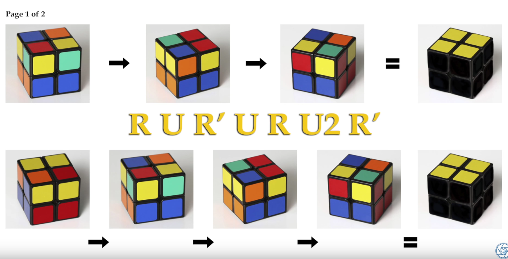
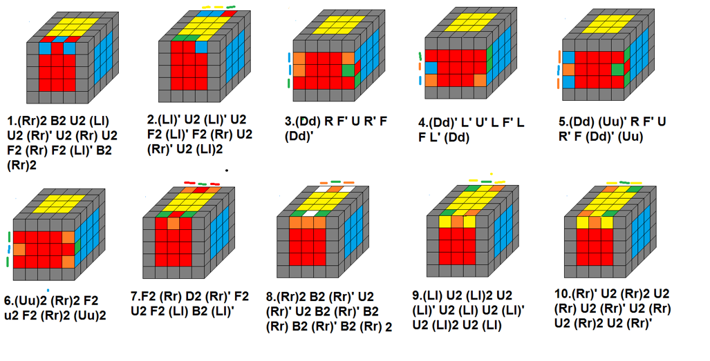

Yellow Cross
------------

Bar:
    F, R, U, R', U', F'

Hook:
    F, U, R, U', R', F'

Yellow Face
-----------

Fish tail:
    R, U, R', U, R, U2, R'

Yellow Corners
--------------

If no matching corners do pattern twice.
Matching corners on matching face at back:
    R', F, R', B2, R, F', R', B2, R2

Final Rotations
---------------

Clockwise:
    R2, U, R, U, R', U', R', U', R', U, R'

Counterclockwise:
    R, U', R, U, R, U, R, U', R', U', R2

2x2x2
=====

4x4x4 Algorithms 
================

Note: Uppercase is outer, lowercase is inner

Last two edges
--------------

If they are diagnol from each other:
    R, U, R', U', F', U, F

Once they are straight across from each other:
    Dd, R, F', U, R', F, Dd'

Yellow edge flip
----------------

r' U2 l F2 l' F2 r2 U2 r U2 r' U2 F2 r2 F2

Ending Resolution
-----------------

If across face mismtaching face towards you.
If on corner, face one mismatched face towards you and face other towards right.
If both across face then do the the across mismatch twice.

Uu2, Rr2, U2, r2, U2, Rr2, Uu2

5x5x5
=====

